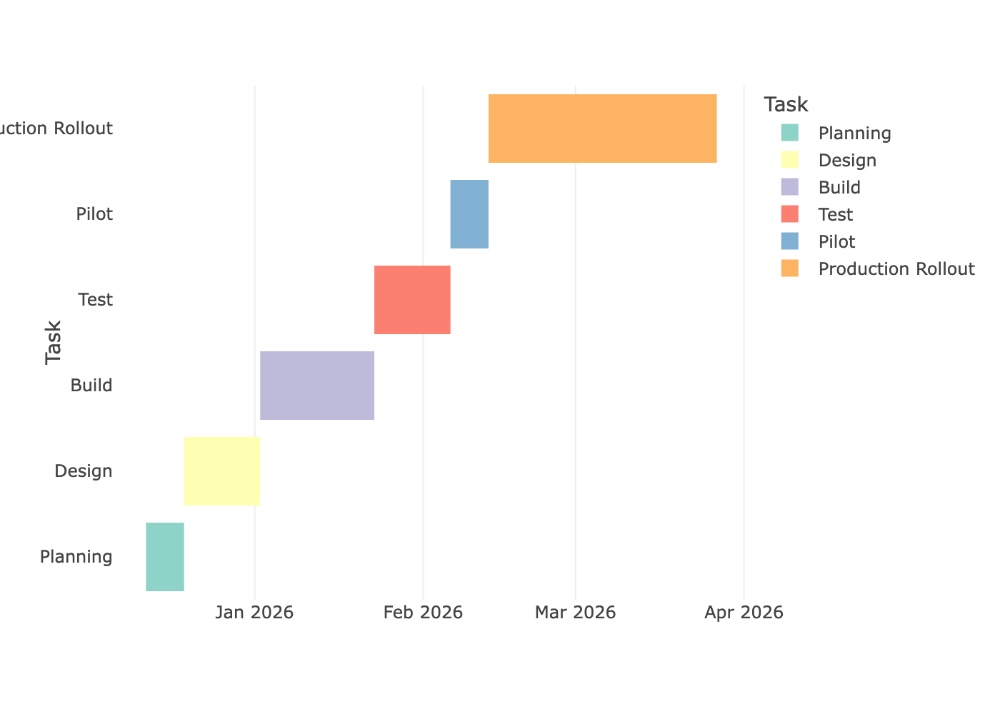

***NAF Network Automation Framework Solution Design Document***

Generated: 2025-12-14T20:26:06Z

## Overview of Automation Initiative
# Automated Configuration Updates
---

## Scope
This automation initiative will automate simple updates to 
- vlans
- ACLs
- SNMP v2 Community Strings
- BGP Peers

## Out of scope
Firewall Policy and Extended ACLs

## Expected use
This automation will be used whenever this task needs to be executed. See Use Cases for more details.

## If not pursued

- We are not improving the speed and quality of our service provisioning

- This task will continue to be executed individually in an inconsistend and ad-hoc manner with variying degerees of success and documentation

### Additional risks in not moving forward
We run the risk of continuing to add technical debt to the logical infrastructure

## My Role
- Who: I’m a network engineer.
- Skills: I have some scripting skills and basic software development experience.
- Developer: My in-house team and I will build it.

## Automation Use Cases Summary

- Use Case 1: Configuration updates

---
# Framework Elements

## Presentation

- Selected user types: Network Engineers, Operations, Help Desk, Authorized Users
- Interaction modes: 
- Presentation tools: Python, Python Web Framework (Streamlit, Flask, etc.)
- Authentication mechanisms: Built-in (to the automation) Authentication via Username/Password or TOKEN

## Intent

- Intent development format(s): Templates
- Intent delivery format(s): Text file

## Observability

- Observability method(s): Purpose-built Python Script
- Go/No-Go text: can log in to network device

- Observability tool(s): Custom Python Scripts, Network Vendor Product (Cisco Catalyst Center, Arista CVP, etc.)

## Orchestration
No Orchestration will be used in this project.

- Orchestration used: No

## Collector

- Collection method(s): CLI/SSH
- Authentication mechanism(s): Username/Password
- Traffic handling: None
- Normalization: None
- Target devices: 7500
- Metrics per second: 32
- Collection cadence: on-demand
- Collection tool(s): 

## Executor

- Execution method(s): Automating CLI interaction with Python automation frameworks (Netmiko, Napalm, Nornir, PyATS)

# Dependencies & External Interfaces
---

- Network Infrastructure

- Revision Control system: GitHub

- ITSM/Change Management System: Service Now

- Authentication System: TACACS

# Staffing, Timeline, & Milestones
---
- Staff 1 • Start 2025-12-12 • Total 75 bd • Completion 2026-03-27

- Planning: 2025-12-12 → 2025-12-19 (5 bd)

- Design: 2025-12-19 → 2026-01-02 (10 bd)

- Build: 2026-01-02 → 2026-01-23 (15 bd)

- Test: 2026-01-23 → 2026-02-06 (10 bd)

- Pilot: 2026-02-06 → 2026-02-13 (5 bd)

- Production Rollout: 2026-02-13 → 2026-03-27 (30 bd)

### Gantt Chart

## Staffing Plan

I will develop this to full POC. If POC is successful, we will engage professional services to operationalize.

---

# Automation Use Cases Detail
---

## Use Case 1: Configuration updates
- **Description / Problem Statement:** Updating devices manually is time consuming and error prone.
This use case is to update a configuration on one or more network devices 

- **Expected Outcome:** Expected automation outcome
- **Category:** Configuration management
- **Trigger:** Planned event (feature add)
- **Building Blocks:** See Solution Wizard

- **Setup Task:** Create a new config file/template 
- **Task(s):** Add/delete/change VLAN
Add/delete/change ACL
Add/delete/change SNMP community
Add/delete/change a BGP peer

- **Deployment Strategy:** Canary
- **Error Conditions:** Unable to update configuration. Rollback to original state

---

NAF NAF Solution Wizard provided by EIA https://eianow.com